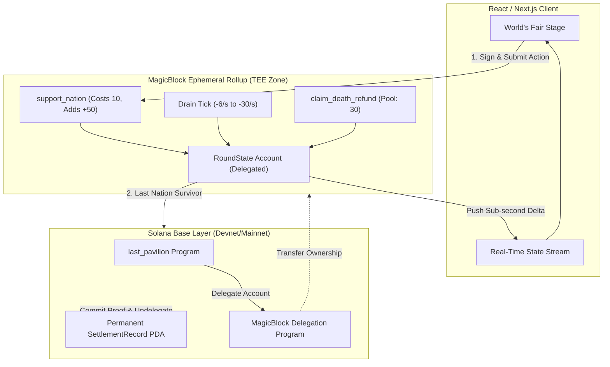

# 🏛️ The Last Pavilion

> **Multiplayer Survival Coordination on Solana & MagicBlock Ephemeral Rollups**  
> *Built for MagicBlock Blitz 9 & Colosseum Crypto's World Fair · October 5–12, 2026*

---

[](https://solana.com)
[](https://magicblock.gg)
[](https://opensource.org/licenses/MIT)

---

## ⚡ The 20-Second Hook

Eight competing crypto ideals entered **Crypto's World Fair**. Their energy is draining continuously in real time.

```
⚡ Velocity    63%  [████████████░░░░░░░░]  00:42 TO EXTINCTION
🔒 Shadow      51%  [██████████░░░░░░░░░░]  00:31 TO EXTINCTION
🏛️ Vault       44%  [████████░░░░░░░░░░░░]  00:26 TO EXTINCTION
💧 Flow        38%  [███████░░░░░░░░░░░░░]  00:19 TO EXTINCTION
🌐 Commons     29%  [█████░░░░░░░░░░░░░░░]  00:14 TO EXTINCTION
🔥 Forge       22%  [████░░░░░░░░░░░░░░░░]  00:09 TO EXTINCTION
⚖️ Council     14%  [██░░░░░░░░░░░░░░░░░░]  00:05 TO EXTINCTION [CRITICAL]
🪨 Genesis     00%  [░░░░░░░░░░░░░░░░░░░░]  💥 FALLEN (REFUND POOL ACTIVE)
```

**Your nation is dying. Spend Influence to save it.**

When a nation hits zero, it is eliminated forever. Each elimination accelerates the drain on survivors. The last nation standing settles permanently on Solana.

---

## 🎪 Why MagicBlock Ephemeral Rollups?

Traditional L1 blockchains cannot support continuously mutating shared state with sub-second feedback:

| Feature | Base Solana L1 | The Last Pavilion (MagicBlock ER) |
|---|---|---|
| **Tick Frequency** | 400ms slot times (jittery for continuous drain) | **10–50ms sub-block execution** in TEE |
| **Intervention Gas** | Transaction fees on every single tap | **Gasless player actions** via ephemeral session delegation |
| **Real-Time Physics** | Congestion causes delayed state updates | **Deterministic continuous meter drain** at 1-second granularity |
| **State Finality** | High write load bloats base ledger history | **Transient competition in ER** · **Only the finale commits to L1** |

---

## 🏛️ The Eight Pavilions

Rather than dividing by chain logos, The Last Pavilion asks visitors to rally around competing foundational crypto ideals:

| Emoji | Pavilion | Core Philosophy |
|---|---|---|
| ⚡ | **Velocity** | Speed, sub-50ms execution, real-time interactivity |
| 🔒 | **Shadow** | Confidentiality, zero-knowledge, individual privacy |
| 🏛️ | **Vault** | Uncompromising self-custody, cryptographic ownership |
| 💧 | **Flow** | Deep liquidity, capital efficiency, frictionless exchange |
| 🌐 | **Commons** | Radical decentralization, open permissionless access |
| 🔥 | **Forge** | Unstoppable innovation, composability, builder agency |
| ⚖️ | **Council** | Scalable governance, dispute resolution, coordination |
| 🪨 | **Genesis** | Immutable settlement, permanent history, hard security |

---

## 🎮 Game Mechanics & Invariants

The game specification enforces **strict compression**: zero new vocabulary is required before the player's first action.

### 1. Political Capital (Influence)
- Every visitor receives a finite budget of **100 Influence** per round.
- Interventions cost **10 Influence** and grant **+50 units** to the target nation's meter (capped at 1,000).
- An on-chain **1-second cooldown** prevents instantaneous dumping, ensuring an authentic tug-of-war dynamic.

### 2. The Acceleration Curve
- Rounds begin with a passive drain of **−6 units/second** per alive nation.
- Each elimination permanently adds **+4 units/second** to the drain rate:
  $$\text{Drain Rate} = 6 + (4 \times \text{eliminated\_nations}) \quad \text{units/sec}$$
  $$(6 \rightarrow 10 \rightarrow 14 \rightarrow 18 \rightarrow 22 \rightarrow 26 \rightarrow 30\text{ units/sec})$$
- The tension curve naturally compresses: calm beginnings evolve into chaotic, rapid-fire endgames.

### 3. Fallen Nation Refund Pool
- When a nation depletes, a **30 Influence refund pool** is unlocked.
- The pool is distributed **proportionally** among that nation's contributors based on total Influence spent.
- **Strategic depth:** Do you spend your remaining capital to preserve your dying faction, or let it collapse to reclaim Influence for the grand finale?

---

## 📐 System Architecture



1. **`open_round` (Solana L1):** Creates the `RoundState` PDA and invokes CPI to the MagicBlock Delegation Program to delegate custody to the TEE validator.
2. **`support_nation` & `drain_tick` (MagicBlock ER):** High-frequency state mutation runs gaslessly at sub-second speeds.
3. **`settle_round` (MagicBlock ER $\rightarrow$ Solana L1):** Once only one pavilion survives, `MagicIntentBundleBuilder::commit_and_undelegate` commits the permanent `SettlementRecord` back to Solana base layer storage.

---

## 🚀 Quickstart

### Prerequisites
- Node.js 18+ & npm
- Rust & Cargo (1.75+)
- Solana CLI & Anchor 0.29+

### 1. Clone & Install
```bash
git clone https://github.com/Olalolo22/last-pavilion.git
cd last-pavilion

# Install web app dependencies
cd app && npm install
```

### 2. Run Web Application
```bash
npm run dev
```
Open [http://localhost:3000](http://localhost:3000) in your browser.

- **Fast Demo Mode:** Append `?speed=fast` to simulate the entire 6–8 minute tension curve in under 60 seconds for live demos.
- **Crowd Frenzy:** Toggle crowd simulation to watch dozens of citizens competing simultaneously.

### 3. Anchor Program Build
```bash
# From workspace root
cargo check --manifest-path programs/last-pavilion/Cargo.toml
```

---

## 📜 Program Instructions

| Instruction | Target Layer | Description |
|---|---|---|
| `open_round` | Solana L1 | Initialises round and delegates PDA to MagicBlock TEE validator |
| `join_round` | MagicBlock ER | Registers player and allocates 100 Influence |
| `support_nation` | MagicBlock ER | Spends 10 Influence, adds +50 meter (enforces 1s cooldown) |
| `drain_tick` | MagicBlock ER | Drains meters, eliminates depleted pavilions, accelerates drain rate |
| `claim_death_refund` | MagicBlock ER | Claims proportional share of 30 Influence refund pool |
| `settle_round` | ER $\rightarrow$ L1 | Writes permanent `SettlementRecord` and commits back to Solana L1 |

---

## ⚖️ License
MIT License. Built with passion for **MagicBlock Blitz 9** (2026).
